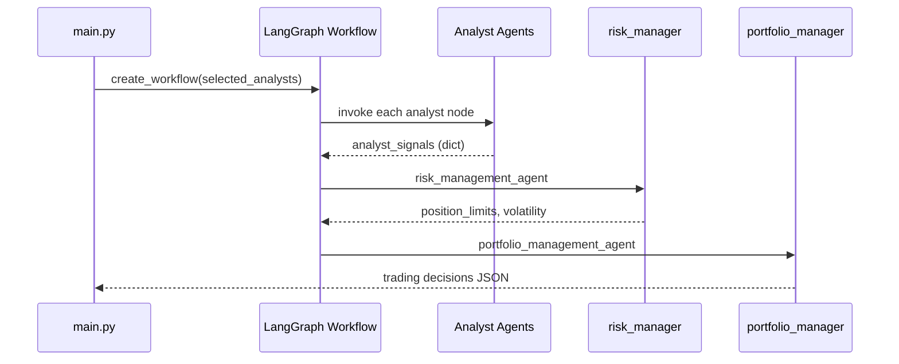

# AI Hedge Fund - Agent Guidelines

**AI Hedge Fund** is a proof-of-concept educational system using multiple AI agents to make simulated trading decisions. The system implements 19 different investor-style agents (Warren Buffett, Ben Graham, Charlie Munger, etc.) plus technical analysis agents that analyze stocks and generate trading signals.

| Component | Technology |
|-----------|------------|
| **Backend** | Python 3.11, FastAPI, LangChain, LangGraph |
| **Database** | SQLAlchemy + Alembic (SQLite) |
| **Frontend** | React 18, TypeScript, Vite, TailwindCSS |
| **Data Viz** | @xyflow/react for agent flow visualization |


## `src/` - Python Backend

### Overview

The `src/` directory contains the core trading logic powered by LangGraph multi-agent orchestration.

```
src/
├── main.py              # CLI entry point - creates workflow, invokes agents
├── backtester.py        # Backtest entry point
├── agents/              # 21 agent implementations
│   ├── portfolio_manager.py   # Final trading decisions
│   ├── risk_manager.py         # Position sizing, volatility analysis
│   ├── valuation.py            # DCF, relative valuation models
│   ├── fundamentals.py         # Financial metrics analysis
│   ├── technicals.py           # Chart patterns, indicators
│   ├── sentiment.py            # Market sentiment signals
│   ├── warren_buffett.py       # Quality at fair price
│   ├── ben_graham.py           # Margin of safety, deep value
│   ├── charlie_munger.py       # Wonderful businesses
│   ├── ... (14 investor agents)
├── graph/
│   └── state.py        # AgentState TypedDict + show_agent_reasoning
├── llm/
│   └── models.py       # LLM provider configuration
├── tools/
│   └── api.py          # Financial data API client + caching
├── data/
│   ├── models.py       # Pydantic models for data validation
│   └── cache.py        # Response caching utilities
├── utils/
│   ├── analysts.py     # ANALYST_CONFIG - single source of truth
│   ├── api_key.py      # API key management from state
│   ├── llm.py          # LLM call wrapper
│   └── progress.py     # Progress tracking
└── backtesting/        # Historical simulation engine
```

### Workflow Architecture



### Agent State (graph/state.py)

LangGraph uses `AgentState` TypedDict to pass data between agents:

## `app/backend/` - FastAPI Backend

### Overview

FastAPI backend serving the web application's API. Connects to `src/` agents and exposes trading operations via REST endpoints.

```
app/backend/
├── main.py              # FastAPI app initialization, CORS, startup events
├── routes/              # API endpoint handlers
│   ├── __init__.py      # Router aggregation
│   ├── hedge_fund.py    # Trading execution, backtesting
│   ├── flows.py         # Graph/node management
│   ├── flow_runs.py     # Execution history
│   ├── storage.py       # File storage operations
│   ├── ollama.py        # Ollama LLM integration
│   ├── language_models.py
│   └── api_keys.py      # API key management
├── services/            # Business logic layer
│   ├── graph.py         # LangGraph workflow builder
│   ├── agent_service.py # Agent function wrapper
│   ├── backtest_service.py
│   ├── portfolio.py     # Portfolio creation
│   └── ollama_service.py
├── models/             # Pydantic schemas & SQLAlchemy models
│   ├── schemas.py       # Request/response models
│   └── events.py        # SSE event types
├── database/
│   ├── connection.py    # SQLAlchemy engine, session
│   └── models.py        # DB table definitions
└── alembic/            # Database migrations
```

### API Routes

| Prefix | Description |
|--------|-------------|
| `/hedge-fund` | Run trading, start backtests |
| `/flows` | Save/load graph configurations |
| `/flow-runs` | Execution history |
| `/storage` | File operations |
| `/ollama` | Local LLM management |
| `/language-models` | LLM provider config |
| `/api-keys` | API key CRUD |

### Database

- **SQLite** at `app/backend/hedge_fund.db`
- **ORM**: SQLAlchemy with Alembic migrations
- **Session**: Dependency `get_db()` for FastAPI routes

---

## `app/frontend/` - React Frontend

### Overview

React 18 frontend with TypeScript. Provides visual agent flow builder using React Flow and connects to the FastAPI backend.

```
app/frontend/src/
├── App.tsx              # Root component
├── components/
│   ├── Flow.tsx         # React Flow canvas
│   ├── Layout.tsx       # Main layout wrapper
│   ├── layout/          # Sidebar, header components
│   ├── panels/          # Output/analysis panels
│   ├── settings/        # Settings dialogs
│   └── ui/              # shadcn/ui components
├── nodes/               # Custom React Flow node components
│   ├── components/
│   │   ├── agent-node.tsx           # Investor agent nodes
│   │   ├── portfolio-manager-node.tsx
│   │   ├── stock-analyzer-node.tsx
│   │   └── ...
│   └── types.ts         # Node type definitions
├── contexts/            # React contexts for state management
│   ├── flow-context.tsx    # React Flow state
│   ├── tabs-context.tsx    # Tab management
│   └── node-context.tsx   # Node data/selection
├── services/            # API clients
│   ├── api.ts              # Main API service
│   ├── flow-service.ts     # Graph persistence
│   └── backtest-api.ts    # Backtest endpoints
├── hooks/               # Custom React hooks
└── types/               # TypeScript type definitions
```

### Key Components

- **Flow.tsx**: React Flow canvas for visual agent graph building
- **nodes/components/**: Custom node types for each agent (Warren Buffett, Ben Graham, etc.)
- **panels/**: Output displays for trading decisions, investment reports

### State Management

React Context API with contexts for:
- `flow-context`: React Flow state (nodes, edges, viewport)
- `tabs-context`: Tab state for multi-tab workflows
- `node-context`: Selected node data, agent output


