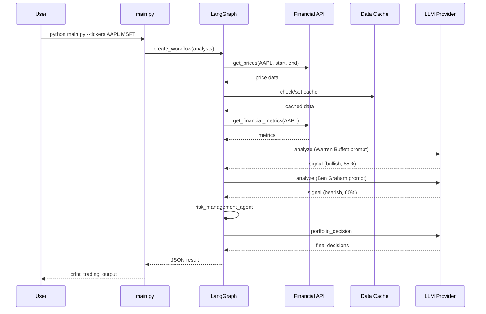

# AI Hedge Fund - Detaillierte technische Dokumentation

## Übersicht

Das **AI Hedge Fund** ist ein Multi-Agent-System das simulierte Trading-Entscheidungen trifft. Es kombiniert fundamentale, technische und sentimentale Analyse mittels 19 verschiedenen Investoren-Agenten (Warren Buffett, Ben Graham, Charlie Munger, etc.) plus Risiko- und Portfolio-Management.

## 1. Ablauf (Workflow)

### 1.1 Main Entry Point

Der Ablauf beginnt in `src/main.py`:

**Schritte:**
1. `create_workflow(selected_analysts)` - erstellt LangGraph StateGraph
2. Jeder Analyst wird als Node hinzugefügt
3. Risk Manager und Portfolio Manager kommen immer dazu
4. Edge-Verbindungen: Analysten → Risk → Portfolio → END

### 1.2 AgentState

Der `AgentState` (`src/graph/state.py`) ist das zentrale Datenobjekt, das durch den gesamten Graph gereicht wird.

**Aufgabe:**
- **Datentransport**: Trägt alle Informationen zwischen Agenten, das ist ein typisches Verfahren, LangGraph ist genau dafür gemacht.
- **Data merge**: `merge_dicts` vereint Dictionaries aus allen Agenten

Der AgentState wird durch den Graph gereicht, weil:

1. **Kollektive Signal-Sammlung**: Jeder Agent schreibt seine Signale in `state["data"]["analyst_signals"]`
2. **Sequentielle Abhängigkeit**: Analysten → Risk Manager → Portfolio Manager
3. **LangGraph Architektur**: Jeder Node updated den State und gibt ihn zurück

### 1.3 Workflow

Der Workflow in `run_hedge_fund()` orchestriert die gesamte Ausführung des Hedge-Fund-Systems:

1. **Workflow erstellen**: `create_workflow(selected_analysts)` baut den Graphen
    Im create_workflow() erstellte Struktur: `start_node → [Analysten (parallel)] → risk_management_agent → portfolio_manager → END`. Siehe 1.4
2. **Kompilieren**: `workflow.compile()` erstellt den ausführbaren Agenten
    `workflow.compile()` ist ein LangGraph-Befehl, der den definierten `StateGraph` in ein ausführbares Agent-Objekt kompiliert. Das kompilierte Objekt kann dann mit `agent.invoke(initial_state)` aufgerufen werden.
3. **agent.invoke()**: Der kompilierte Agent wird mit dem initialen State aufgerufen
4. **Ergebnis**: Trading-Entscheidungen und Analysten-Signale werden zurückgegeben

### 1.4 Nodes und Edges im create_workflow()

**Node (Knoten):**
- Ein Node ist eine ausführbare Funktion/ein Agent im Graph
- Beispiele: `warren_buffett_agent`, `risk_management_agent`, `portfolio_manager`
- Jeder Node erhält den `AgentState`, verarbeitet ihn und gibt aktualisierten State zurück

**Agent-Funktion (`agent_func`) vs. Node-Funktion (`node_func`):**

Die `agent_func` ist die **eigentliche Agent-Logik** (in `src/agents/warren_buffett.py` etc.):
- Enthält alle API-Calls, lokale Analysen und LLM-Aufrufe
- Wird als `node_func` in den LangGraph-Workflow eingehängt
- Jeder Agent ist eine eigenständige Python-Funktion mit Signatur: `def warren_buffett_agent(state: AgentState) -> dict`

Dann wird diese Funktion als Node im Graph registriert.

**Jeder Node läuft in seinem eigenen Kontext, aber innerhalb desselben Prozesses:**
- LangGraph orchestriert die Ausführung
- Analysten laufen **parallel** (quasi-gleichzeitig)
- **Keine separaten Prozesse/Threads** - Python-Threads oder -Prozesse
- Jeder Node wird sequentiell vom LangGraph-Executor aufgerufen, aber mit `invoke()` quasi-parallel
- Der LLM-Call ist der **blocking Teil** - dort wartet der Code auf die API-Response

**Edge (Verbindung):**
- Ein Edge definiert den Kontrollfluss zwischen Nodes
- Bestimmt, welcher Node als nächster ausgeführt wird
- Beispiele:

```python
workflow.add_edge("start_node", "warren_buffett_agent")  # Start → Buffett
workflow.add_edge("start_node", "charlie_munger_agent")  # Start → Munger
workflow.add_edge("start_node", "peter_lynch_agent")     # Start → Lynch

workflow.add_edge("warren_buffett_agent", "risk_management_agent")  # Buffett → Risk
workflow.add_edge("charlie_munger_agent", "risk_management_agent") # Munger → Risk
workflow.add_edge("peter_lynch_agent", "risk_management_agent")     # Lynch → Risk

workflow.add_edge("risk_management_agent", "portfolio_manager")  # Risk → Portfolio
workflow.add_edge("portfolio_manager", END)  # Portfolio → Ende
```

**Wichtig, die Analysten sind unabhängig voneinander!, da sie PARALLEL laufen.**

Tatsächliche Architektur:
```
Warren Buffett Agent ──┐
                       │  Diese werden PARALLEL ausgeführt (in der Praxis)
Ben Graham Agent     ──┤  Jeder holt seine eigenen Daten von der API
Charlie Munger Agent ──┘  Jeder ruft sein eigenes LLM auf

         ↓ (nach allen Analysten)

Risk Manager ──→ braucht alle Analyst-Signale für Position-Limits

         ↓ (nach Risk)

Portfolio Manager ──→ braucht Analyst-Signale + Risk-Daten für finale Entscheidung
```

**Die Analysten hängen NICHT voneinander ab:**
- Warren Buffett sieht NICHT Ben Grahams Analyse
- Jeder analysiert unabhängig mit eigenen Prompts und Regeln
- Jeder hat eigene API-Calls (get_financial_metrics, etc.)

**Nur Portfolio Manager braucht ALLE Signale:**
- Wenn 15 von 19 Analysten bullish sind → eher buy
- Wenn nur 2 von 19 bullish sind → eher sell/hold

## 1.5 Risk Management Agent

Der `risk_management_agent` (`src/agents/risk_manager.py`) steuert die Positionsgrößen basierend auf volatilitätsadjustierten Risikofaktoren für mehrere Ticker.

### Aufgaben:

1. **Preisdaten abrufen und Volatilität berechnen**
   - Für jeden Ticker: historische Kurse von der API holen
   - Tägliche Volatilität und annualisierte Volatilität berechnen (Standardabweichung der Renditen × √252)
   - Volatilitäts-Perzentil berechnen (aktuelle Volatilität vs. historische Rolling-Volatilität)

2. **Positionslimits berechnen**
   - `calculate_volatility_adjusted_limit()`: Basis-Limit von 20% des Portfolios, angepasst nach Volatilität:
     - Niedrige Volatilität (<15%): bis 25% Allokation
     - Mittlere Volatilität (15-30%): 12,5-20% Allokation
     - Hohe Volatilität (30-50%): 5-15% Allokation
     - Sehr hohe Volatilität (>50%): max. 10% Allokation

3. **Korrelationsanalyse**
   - Korrelationsmatrix zwischen allen Tickers berechnen
   - `calculate_correlation_multiplier()`: Anpassungsfaktor basierend auf durchschnittlicher Korrelation
   - Sehr hohe Korrelation (≥0,8): Limit um 30% reduzieren
   - Hohe Korrelation (0,6-0,8): Limit um 15% reduzieren
   - Moderate Korrelation (0,4-0,6): neutral
   - Niedrige Korrelation (<0,2): Limit um 10% erhöhen

4. **Risiko-Limits pro Ticker**
   - Kombiniertes Positionslimit: Volatilitäts-Limit × Korrelations-Multiplikator
   - Verbleibendes Limit = Positionslimit - aktueller Positionswert
   - Berücksichtigt verfügbares Bargeld

### Wichtige Funktionen:

| Funktion | Beschreibung |
|----------|---------------|
| `calculate_volatility_metrics()` | Berechnet tägliche/annualisierte Volatilität und Perzentil |
| `calculate_volatility_adjusted_limit()` | Volatilitätsbasierte Positionsgröße (5-25%) |
| `calculate_correlation_multiplier()` | Korrelationsbasierte Anpassung (0,7-1,1) |

## 1.6 Portfolio Management Agent

Der `portfolio_management_agent` (`src/agents/portfolio_manager.py`) trifft finale Trading-Entscheidungen und generiert Orders für mehrere Ticker.

### Aufgaben:

1. **Risikodaten von Risk Manager abrufen**
   - Position Limits und aktuelle Preise aus `analyst_signals["risk_management_agent"]`
   - Max. Anzahl Aktien basierend auf Limit ÷ Preis

2. **Analyst-Signale komprimieren**
   - Für jeden Ticker: Signale aller Analysten sammeln
   - Format: `{agent_name: {"sig": signal, "conf": confidence}}`

3. **Erlaubte Aktionen berechnen**
   - `compute_allowed_actions()`: Deterministische Berechnung was möglich ist:
     - Buy: wenn Bargeld vorhanden und Preis > 0
     - Sell: wenn Long-Position besteht
     - Short: wenn Margin verfügbar
     - Cover: wenn Short-Position besteht
     - Hold: immer erlaubt
   - Berücksichtigt Margin-Anforderungen und vorhandene Positionen

4. **Trading-Entscheidungen vom LLM generieren**
   - Prefill: Wenn nur "hold" möglich → direkt als Hold entscheiden (kein LLM-Call)
   - LLM-Prompt mit komprimierten Signalen und erlaubten Aktionen
   - LLM wählt eine erlaubte Aktion pro Ticker mit Quantity ≤ Max

### Wichtige Funktionen:

| Funktion | Beschreibung |
|----------|---------------|
| `compute_allowed_actions()` | Deterministische Berechnung erlaubter Aktionen |
| `_compact_signals()` | Signale auf {sig, conf} komprimieren |
| `generate_trading_decision()` | LLM mit constraints aufrufen |

### Entscheidungslogik:

1. **Hole Risk-Daten**: Position Limits und Preise vom Risk Manager
2. **Prüfe ob Trade möglich**: Nur "hold" → direkt returnen
3. **Sende an LLM**: Signale + erlaubte Aktionen
4. **Merge**: Prefilled Holds + LLM-Entscheidungen

Das stellt sicher, dass:
- Nur erlaubte Aktionen gewählt werden
- Quantity das Limit nicht überschreitet
- Kein LLM-Call wenn nichts zu entscheiden ist

---

## 2. Datenquellen

Alle Finanzdaten kommen von der **Financial Datasets API** (`api.financialdatasets.ai`):

| Funktion | Daten | Endpunkt |
|----------|-------|----------|
| `get_prices()` | Tageskurse (Open, Close, High, Low, Volume) | `/prices/` |
| `get_financial_metrics()` | ROE, Debt-to-Equity, Operating Margin, etc. | `/financial-metrics/` |
| `search_line_items()` | Bilanzdaten (Revenue, Net Income, etc.) | `/financials/search/line-items` |
| `get_insider_trades()` | Insider-Käufe/Verkäufe | `/insider-trades/` |
| `get_company_news()` | Nachrichtenartikel | `/news/` |
| `get_market_cap()` | Marktkapitalisierung | `/company/facts/` |


Die Daten werden **innerhalb jedes Agenten** angefordert, wenn er läuft.

### 2.1 Cache System

Alle API-Antworten werden gecached in `src/data/cache.py` (JSON-Dateien) um:
- API-Costs zu sparen
- Schnellere Wiederholungsläufe zu ermöglichen

```
Agent fragt API an
       ↓
check: _cache.get_prices(cache_key)
       ↓
Wenn cached → return sofort (kein API Call)
Wenn NICHT cached → API call → _cache.set_prices(...) → return
```

**Cache Key:** `{ticker}_{start_date}_{end_date}` (z.B. `AAPL_2024-01-01_2024-03-31`)

---

## 3. LLM Aufrufe

### 3.1 Wann werden LLMs aufgerufen?

LLMs werden **pro Agent** aufgerufen. Die Analysten laufen **parallel** (gleichzeitig) via LangGraph.

**Es werden KEINE neuen Prozesse bei dir gestartet.**
- Du sendest einfach HTTP POST Requests
- Der Provider hat das GPU-Cluster und die Inference-Engine
- Dein Code wartet auf die Response (blocking)

#### 3.1.1 Wann wird die Nachricht an den LLM gesendet?

**Es werden MEHRERE EINZELNE Nachrichten gesendet - eine für JEDEN Agenten/Node:**

| Node | LLM-Aufruf | Wann |
|------|-----------|------|
| Warren Buffett Agent | 1x pro Ticker | Parallel mit anderen |
| ... (alle 19 Analysten) | jeweils 1x pro Ticker | Parallel |
| Risk Manager | 1x (aggregiert) | Nach allen Analysten |
| Portfolio Manager | 1x (aggregiert) | Nach Risk Manager |

**Beispiel bei 3 Tickers und 5 Analysten:**
- Warren Buffett: 3 LLM-Aufrufe (AAPL, MSFT, GOOG)
- Ben Graham: 3 LLM-Aufrufe
- Charlie Munger: 3 LLM-Aufrufe
- Peter Lynch: 3 LLM-Aufrufe
- Cathie Wood: 3 LLM-Aufrufe
- Risk Manager: 1 LLM-Aufruf
- Portfolio Manager: 1 LLM-Aufruf

**= 16 einzelne LLM-Aufrufe** (bei 3 Ticks und 5 Analysten)

```python
# ABER: Jeder Agent macht seine eigenen LLM-Aufrufe intern:
# src/agents/warren_buffett.py
buffett_output = call_llm(prompt=prompt, ...)  # LLM-Aufruf #1

# src/agents/ben_graham.py
graham_output = call_llm(prompt=prompt, ...)    # LLM-Aufruf #2
```

### 3.2 Wie laufen die Analysten genau?

**Die Analysten laufen PARALLEL**, nicht sequentiell!

```
                    ┌─→ Warren Buffett ──┐
start_node ─────────┼─→ Ben Graham        ──┼─→ risk_management
                    └─→ Charlie Munger ───┘
```

Jeder Analyst:
1. Liest die **ursprünglichen Daten** (tickers, dates) aus dem Start-State (INITIAL STATE)
2. Führt seine eigene Analyse durch (API-Calls, LLM)
3. Schreibt sein Signal in `state["data"]["analyst_signals"]`

Die Analysten brauchen **nicht** das Ergebnis der anderen Analysten - jede Analyse ist unabhängig. Daher ist parallele Ausführung sicher.

**Fan-in wartet auf alle:** Der Risk Manager wird erst aufgerufen, wenn ALLE Analysten fertig sind. LangGraph merged dann alle Signale automatisch.

### 3.3 Was passiert bei mehreren Agenten?

- LangGraph intern (vereinfacht)
- Alle Analysten werden quasi-gleichzeitig gestartet
- Jeder wartet auf sein eigenes LLM-Response

- Analysten sind **unabhängig** - keiner braucht das Ergebnis eines anderen
- Jeder liest nur den initialen Start-State
- Jeder schreibt sein eigenes Signal in `analyst_signals`
- LangGraph merged die States automatisch vor dem Risk Manager

Die Funktion `call_llm()` wird von allen Agenten verwendet:

```python
def call_llm(prompt, pydantic_model, agent_name, state, default_factory):
    # 1. Model-Config aus State holen
    # 2. API-Keys aus State holen
    # 3. LLM-Instanz erstellen via get_model()
    # 4. Structured Output (JSON Mode) konfigurieren
    # 5. LLM aufrufen mit retries
    # 6. Pydantic Model zurückgeben
```

### 3.4 Prompt-Struktur

Beispiel Warren Buffett (in `src/agents/warren_buffett.py`):

```python
template = ChatPromptTemplate.from_messages([
    ("system", "You are Warren Buffett. Decide bullish, bearish, or neutral..."),
    ("human", "Ticker: {ticker}\nFacts: {facts}\nReturn: {json_schema}")
])
```

Jeder Agent hat eigene Prompts mit investorenspezifischen Regeln.

### 3.4 Daten zur LLM-Anfrage hinzufügen

**Wo?** In der `generate_*_output()` Funktion jedes Agenten.

**Datenfluss:**

```
Agent-Funktion (z.B. warren_buffett_agent)
        ↓
API-Calls (get_financial_metrics, etc.)
        ↓
Lokale Python-Analyse (calculate ratios, scores)
        ↓
facts Dictionary erstellen
        ↓
ChatPromptTemplate.invoke({...}) (Daten in Template einsetzen)
        ↓
LLM mit befülltem Prompt aufrufen
```

### 3.5 Lokale Python-Analyse der Aktiendaten

Bevor die Daten an das LLM gehen, führt jeder Agent **lokale Python-Analysen** durch. Das hat mehrere Vorteile:
- **Konsistenz**: Alle Agenten nutzen dieselben Berechnungslogiken
- **Kosteneffizienz**: Weniger LLM Tokens durch komprimierte Fakten
- **Reproduzierbarkeit**: Gleiche Daten → gleiche Scores

**Analyse-Funktionen:**

| Funktion | Was sie analysiert | Score-Berechnung |
|----------|-------------------|------------------|
| `analyze_fundamentals()` | ROE, Debt/Equity, Operating Margin, Current Ratio | +2 für gute Werte (>15% ROE, <0.5 D/E), +1 für Current Ratio >1.5 |
| `analyze_consistency()` | Gewinnwachstum über Zeit | +2 für konsistentes Wachstum, +1 für teilweise |
| `analyze_moat()` | ROE-Stabilität, Margen-Stabilität, Asset Efficiency | +2 für konsistent >15% ROE, +1 pro weiterem Faktor |
| `analyze_pricing_power()` | Gross Margins Trend | +3 für expandierende Margins, +2 für stabile |
| `analyze_book_value_growth()` | Buchwertwachstum pro Aktie | +3 für konsistentes Wachstum |
| `analyze_management_quality()` | Share Buybacks, Dividenden | +1 für Buybacks, +1 für Dividenden |
| `calculate_intrinsic_value()` | DCF-Bewertung (3-Stage) | Owner Earnings → PV aller Cashflows |

Jeder Investor hat eine andere **Anlage-Philosophie** und analysiert daher unterschiedliche Metriken:

| Agent | Fokus | Analyse-Metriken |
|-------|-------|-----------------|
| Warren Buffett | Moat, Intrinsischer Wert | ROE, Book Value Growth, Pricing Power, DCF |
| Ben Graham | Deep Value | Earnings Stability, Financial Strength, Graham Number |
| Charlie Munger | Wonderful Businesses | Moat Strength, Predictability, Management |
| Peter Lynch | Growth | Growth Rates, PEG Ratio |
| Cathie Wood | Disruption | Innovation, TAM |
| Nassim Taleb | Antifragility | Tail Risk, Convexity |

Beispiel:
- Buffett nutzt **Owner Earnings DCF** für Intrinsic Value
- Graham nutzt **Earnings Stability**
- Lynch nutzt **PEG Ratio**

Die lokalen Analysen sind **philosophie-spezifisch**.

Diese komprimierten Fakten werden dann als JSON in den Prompt eingespeist

### 3.6 Interpretation des LLM-Rückgabewerts

Der LLM-Rückgabewert wird durch **Pydantic Models** interpretiert und validiert:

**Ablauf in `src/utils/llm.py`:**

```python
def call_llm(
    prompt,                  # Der Prompt (ChatPromptTemplate)
    pydantic_model,         # Z.B. WarrenBuffettSignal, PortfolioDecision
    agent_name,             # Für Progress-Updates
    state,                  # Für Model-Config
    max_retries: int = 3,    # Retry-Logik
    default_factory=None,   # Fallback bei Fehler
) -> BaseModel:
```

**Schritte:**

1. **Model-Config laden**: Aus State den passenden LLM (GPT-4, Claude, etc.) finden
2. **Structured Output konfigurieren**:
   - Bei JSON-fähigen Models: `llm.with_structured_output(pydantic_model, method="json_mode")`
   - Bei nicht-JSON-fähigen: `extract_json_from_response()` für Markdown-Extraction
3. **LLM aufrufen**: `result = llm.invoke(prompt)`
4. **Pydantic Model instanziieren**: Automatische Validierung via `pydantic_model(**parsed_result)`
5. **Retry bei Fehler**: Bis zu 3 Versuche bei Ausnahmen

**Fallback bei Fehler:**

Wenn der LLM scheitert (nach 3 Retries), wird ein **Default-Response** erstellt:

```python
def create_default_response(model_class):
    # Für Strings: "Error in analysis, using default"
    # Für Float/Int: 0.0 / 0
    # Für Dict: {}
    return model_class(**default_values)
```

Das stellt sicher, dass der Workflow nicht abbricht, sondern mit einem neutralen/sicheren Default weiterläuft.

### 3.7 Sicherstellung der Interpretierbarkeit

Die Interpretierbarkeit wird durch mehrere Mechanismen sichergestellt:

**Explizites JSON-Schema im Prompt**

Das erwartete Format wird **direkt im Prompt** als Beispiel angegeben:

```python
# src/agents/warren_buffett.py
template = ChatPromptTemplate.from_messages([
    ("system", "You are Warren Buffett..."),
    ("human", 
     "Return exactly:\n"
     "{{\n"
     '  "signal": "bullish" | "bearish" | "neutral",\n'
     '  "confidence": int,\n'
     '  "reasoning": "short justification"\n'
     "}}"
    ),
])
```

**Pydantic Model als strenges Schema**

Bei falschem Format → **Pydantic ValidationError** → Retry.
    reasoning: str = Field(description="Reasoning for the decision")  # String required

Bei falschem Format → **Pydantic ValidationError** → Retry.

**System-Prompt mit strikten Regeln**

```python
"Signal rules:\n"
"- Bullish: strong business AND margin_of_safety > 0.\n"
"- Bearish: poor business OR clearly overvalued.\n"
"- Neutral: good business but margin_of_safety <= 0, or mixed evidence.\n"
```


---

## 4. Ergebnisse

### 4.1 Wo landet das Ergebnis?

**Agent-Funktion Rückgabewert:**

Jede Agent-Funktion (z.B. `warren_buffett_agent`) gibt folgendes Dictionary zurück:

```python
{"messages": [message], "data": state["data"]}
```

- `message`: Ein `HumanMessage` mit dem Signal als JSON-String
- `data`: Der aktualisierte State mit allen Analyst-Signalen

**LLM Response Speicherort:**

Der LLM-Rückgabewert ist ein **Pydantic Model** (z.B. `WarrenBuffettSignal`), das von `call_llm()` zurückgegeben wird:

1. ** Direkt im Agenten** (z.B. `warren_buffett.py:126-139`):
   ```python
   buffett_output = generate_buffett_output(...)  # LLM Response als Pydantic Model
   buffett_analysis[ticker] = {
       "signal": buffett_output.signal,
       "confidence": buffett_output.confidence,
       "reasoning": buffett_output.reasoning,
   }
   state["data"]["analyst_signals"][agent_id] = buffett_analysis
   ```

2. **Im AgentState** (`src/graph/state.py`):
   - `state["data"]["analyst_signals"][agent_id]` = Dict mit {ticker: {signal, confidence, reasoning}}
   - Alle Agent-Signale werden in `analyst_signals` gesammelt

**Zusammenfassung:**

| Komponente | Speicherort | Inhalt |
|------------|-------------|--------|
| LLM Response | `call_llm()` Rückgabe | Pydantic Model (signal, confidence, reasoning) |
| Agent Signal | `state["data"]["analyst_signals"][agent_id]` | {ticker: {signal, confidence, reasoning}} |
| Alle Signale | `state["data"]["analyst_signals"]` | {agent_id: {...}} |
| Portfolio Entscheidung | `state["data"]["portfolio_decisions"]` | {ticker: {action, quantity, ...}} |
| Finales Ergebnis | CLI Output | JSON mit allen Entscheidungen |


### 4.2 Backtesting

Das Backtesting-System simuliert den Handel über einen historischen Zeitraum. Der Einstiegspunkt ist `src/backtester.py`, der die `BacktestEngine` (`src/backtesting/engine.py`) orchestriert.

#### Ablauf:

```
src/backtester.py
        ↓
BacktestEngine.run_backtest()
        ↓
1. _prefetch_data()     → API-Daten für alle Ticker vorsorgen
2. date_range(start, end, freq="B")  → Alle Handelstage
        ↓
Für jeden Handelstag:
        ↓
a) Preise abrufen (get_price_data)
        ↓
b) Agent ausführen (AgentController.run_agent)
        → ruft run_hedge_fund() mit Lookback-Fenster auf
        → erhält Trading-Entscheidungen
        ↓
c) Trades ausführen (TradeExecutor.execute_trade)
        → Buy/Sell/Short/Cover gegen Portfolio
        ↓
d) Portfolio-Bewertung (calculate_portfolio_value)
        → Long/Short Exposure berechnen
        ↓
e) Performance-Metriken (PerformanceMetricsCalculator)
        → Sharpe, Sortino, Max Drawdown, etc.
        ↓
f) Ergebnisse sammeln und anzeigen
```

#### Hauptkomponenten:

| Komponente | Datei | Beschreibung |
|------------|-------|-------------|
| `BacktestEngine` | `src/backtesting/engine.py` | Orchestriert den gesamten Backtest-Loop |
| `TradeExecutor` | `src/backtesting/trader.py` | Führt Trades gegen Portfolio aus (Buy/Sell/Short/Cover) |
| `Portfolio` | `src/backtesting/portfolio.py` | Verwaltet Cash, Positionen, Margin |
| `AgentController` | `src/backtesting/controller.py` | Ruft den Agenten mit historischen Daten auf |
| `PerformanceMetricsCalculator` | `src/backtesting/metrics.py` | Berechnet Sharpe, Sortino, Max Drawdown |
| `BenchmarkCalculator` | `src/backtesting/benchmarks.py` | Benchmark-Vergleich (z.B. SPY) |

#### Prefetch-Daten:

Vor dem Backtest werden API-Daten für 1 Jahr vorgehalten:
- Preise (get_prices)
- Finanzkennzahlen (get_financial_metrics)
- Insider-Trades (get_insider_trades)
- Nachrichten (get_company_news)
- SPY für Benchmark-Vergleich

#### Täglicher Loop (Rolling Window Simulation):

Das Backtesting nutzt ein **Rolling-Window-Verfahren** mit **täglicher Granularität** (`freq="B"` = Business Days):

```
Beispiel: Backtest vom 01.01.2024 bis 31.12.2024

≈ 252 Handelstage × 19 Analysten = ~4.788 LLM-Calls!

Tag 1 (2024-02-01):
├── Agent analysiert: Daten vom 01.01.2024 bis 01.02.2024 (1 Monat Lookback)
├── Agent sagt: "buy AAPL"
├── Trade wird ausgeführt zum Schlusskurs vom 01.02.2024
└── Portfolio aktualisiert

Tag 2 (2024-02-02):
├── Agent analysiert: Daten vom 02.01.2024 bis 02.02.2024
├── Agent sagt: "hold"
└── Portfolio bleibt

... (wiederholt für jeden Handelstag ≈ 252x)

Am Ende (31.12.2024):
├── Portfolio-Wert = Summe aller Trades
├── Metriken zeigen: "War die Strategie erfolgreich?"
└── Benchmark-Vergleich: vs. Buy & Hold SPY
```

**Kosten-Hinweis**: Bei 19 Analysten × 252 Tage = ~4.788 LLM-Calls pro Jahr. Das ist teuer und langsam.

**Wichtig**: Der Agent weiß nicht, was morgen passiert! Er trifft Entscheidungen nur auf Basis der Daten bis zu diesem Tag. Am Ende wird geschaut, ob die Vorhersagen richtig waren.

#### Warum funktioniert Backtesting so?

1. **Kein Future Leak**: Agent sieht nur historische Daten
2. **Realistische Simulation**: Trades werden zu realen Preisen ausgeführt
3. **Kumulative Performance**: Alle Trades werden addiert
4. **Benchmark-Vergleich**: vs. SPY zeigt ob Agent besser ist

**Beispiel-Ergebnis**:
- Start-Kapital: $100.000
- End-Kapital: $120.000 (+20%)
- Benchmark (SPY): +15%
- **Outperformance**: +5% vs. Markt

#### Performance-Metriken:

```python
{
    "sharpe_ratio": float,           # Risikoadjustierte Rendite
    "sortino_ratio": float,          # Nur Downside-Risiko
    "max_drawdown": float,           # Maximaler Verlust vom Peak
    "long_short_ratio": float,       # Long/Short-Verhältnis
    "gross_exposure": float,        # |Long| + |Short| relativ zu Kapital
    "net_exposure": float,           # (Long - Short) relativ zu Kapital
}
```

---

## 5. FastAPI Backend

Das **FastAPI Backend** (`app/backend/`) ist der REST-API-Server, der das Multi-Agent-System über HTTP-Endpunkte zugänglich macht. Es verbindet das Frontend mit den Core-Agenten in `src/`.

| Router | Prefix | Datei | Aufgabe |
|--------|--------|-------|---------|
| `health` | `/` | `routes/health.py` | Health-Checks, Root-Endpoint, Ping |
| `hedge_fund` | `/hedge-fund` | `routes/hedge_fund.py` | Trading-Execution, Backtest, Agent-Liste |
| `flows` | `/flows` | `routes/flows.py` | Graph-Konfigurationen: CRUD für Flow-Templates |
| `flow_runs` | `/flows/{id}/runs` | `routes/flow_runs.py` | Ausführungsverlauf: Tracking von Flow-Runs |
| `storage` | `/storage` | `routes/storage.py` | Dateispeicherung: JSON in `/outputs` speichern/laden |
| `ollama` | `/ollama` | `routes/ollama.py` | Lokale LLM-Verwaltung: Modelle ziehen, Status |
| `language_models` | `/language-models` | `routes/language_models.py` | LLM-Provider: Konfiguration verschiedener LLM-Anbieter |
| `api_keys` | `/api-keys` | `routes/api_keys.py` | API-Key-Verwaltung: CRUD für API-Keys |

### 5.2 Datenbank

Die SQLite-Datenbank (`app/backend/hedge_fund.db`) dient **nur der UI** und speichert keine Core-Analyse-Daten:

| Tabelle | Nutzung |
|--------|---------|
| `hedgefundflow` | Flow-Templates (Nodes, Edges) für visuelle Graph-Erstellung |
| `hedgefundflowrun` | Ausführungsverlauf + Ergebnisse |
| `languagemodel` | LLM-Provider-Konfigurationen |
| `apikey` | API-Keys (Financial Datasets, OpenAI) |

**Wichtig: Die Database hat keinen Einfluss auf die Core-Analyse in `src/`!**

Die Agenten in `src/` brauchen keine Datenbank:
- Kein State zwischen Aufrufen
- Keine Persistenz nötig
- Nur Input (Ticker, Datum) → Output (Entscheidung)

**Zweck:** Praktisch für die Web-UI (Flows speichern, History sehen, Keys merken), aber die echte Trading-Logik in `src/` läuft komplett losgelöst.

#### POST `/hedge-fund/run`

Startet eine Trading-Execution mit SSE-Streaming:

**Request:**
```python
{
    "tickers": ["AAPL", "MSFT"],
    "start_date": "2024-01-01",
    "end_date": "2024-03-31",
    "initial_cash": 100000.0,
    "margin_requirement": 0.0,
    "graph_nodes": [],
    "graph_edges": [],
    "model_name": "gpt-4",
    "model_provider": "openai"
}
```

**Response:** Server-Sent Events (SSE) mit `media_type="text/event-stream"`

**Event-Typen:**
| Event | Beschreibung |
|-------|---------------|
| `StartEvent` | Session beginnt |
| `ProgressUpdateEvent` | Agent-Fortschritt (agent, ticker, status, analysis, timestamp) |
| `ErrorEvent` | Fehlermeldung |
| `CompleteEvent` | Finale Entscheidungen + Analyst-Signale + Preise |

**CompleteEvent Datenstruktur:**
```python
{
    "decisions": {
        "AAPL": {"action": "buy", "quantity": 10, "price": 150.00, "total": 1500.00},
        "MSFT": {"action": "hold", "quantity": 0, "price": 0, "total": 0}
    },
    "analyst_signals": {
        "warren_buffett": {"AAPL": {"signal": "bullish", "confidence": 85, "reasoning": "..."}},
        "ben_graham": {...}
    },
    "current_prices": {
        "AAPL": 150.00,
        "MSFT": 380.00
    }
}
```

**Beispiel curl:**
```bash
curl -X POST http://localhost:8000/api/hedge-fund/run \
  -H "Content-Type: application/json" \
  -d '{
    "tickers": ["AAPL"],
    "start_date": "2024-01-01",
    "end_date": "2024-03-31",
    "initial_cash": 100000,
    "graph_nodes": [],
    "graph_edges": [],
    "model_name": "gpt-4",
    "model_provider": "openai"
  }'
```

#### POST `/hedge-fund/backtest`

Startet einen Backtest mit täglicher Simulation:

**Request:** Wie `/run`, plus:
```python
{
    "initial_capital": 100000.0,
    "margin_requirement": 0.0,
    "portfolio_positions": {}
}
```

**Response:** SSE mit:
- `ProgressUpdateEvent`: Täglicher Fortschritt
- `CompleteEvent`: Performance-Metriken + Finales Portfolio

### 5.5 SSE (Server-Sent Events)

SSE ist eine Technologie für **Echtzeit-Kommunikation** vom Server zum Client über eine einzelne offene HTTP-Verbindung.

**Eigenschaften:**
| Aspekt | Beschreibung |
|--------|-------------|
| **Richtung** | Nur Server → Client (einseitig) |
| **Verbindung** | Eine offene HTTP-Verbindung wird offen gehalten |
| **Format** | JSON-Nachrichten im Text-Stream: `data: {"key": "value"}\n\n` |
| **Browser-Support** | Alle modernen Browser via EventSource API |
| **Alternative** | WebSocket (bidirektional) |

**Datenfluss:**
```
Client                              Server
  │                                   │
  ├─ POST /run (request) ──────────→  │
  │                                   │
  ←─ event: start ─────────────────  │
  ←─ event: progress ────────────────  │
  ←─ event: progress ────────────────  │
  ←─ event: complete ────────────────  │
  │                                   │
  (Verbindung geschlossen)
```

Das Backend nutzt SSE für Echtzeit-Updates:

```python
# Event-Typen (app/backend/models/events.py)
StartEvent         # Session gestartet
ProgressUpdateEvent # agent, ticker, status, analysis, timestamp
ErrorEvent        # Fehlermeldung
CompleteEvent    # data mit Entscheidungen/Signalen
```

### 5.6 Interaktion mit der API

#### CLI starten

```bash
cd app/backend
uvicorn main:app --reload --port 8000
```

Server läuft dann unter: `http://localhost:8000`

**Trading ausführen:**
```bash
curl -X POST http://localhost:8000/api/hedge-fund/run \
  -H "Content-Type: application/json" \
  -d '{
    "tickers": ["AAPL"],
    "start_date": "2024-01-01",
    "end_date": "2024-03-31",
    "initial_cash": 100000,
    "graph_nodes": [],
    "graph_edges": [],
    "model_name": "gpt-4",
    "model_provider": "openai"
}'
 ```

### 5.6 Portfolio-Zwischenspeicherung

Das System hat **keinen dedizierten Endpunkt** zum Speichern des Portfolio-Zustands. Es gibt zwei Methoden:

**Methode 1: portfolio_positions im Request**

Bei jedem `/hedge-fund/run` Aufruf kann das aktuelle Portfolio übergeben werden:

```python
{
    "tickers": ["AAPL", "MSFT"],
    "start_date": "2024-01-01",
    "end_date": "2024-03-31",
    "initial_cash": 100000.0,
    "margin_requirement": 0.0,
    "portfolio_positions": [
        {"ticker": "AAPL","quantity": 10,"trade_price": 150.00,"position_type": "long"},
        {"ticker": "MSFT","quantity": 5,"trade_price": 380.00,"position_type": "long"}
    ],
    "graph_nodes": [],
    "graph_edges": [],
    "model_name": "gpt-4",
    "model_provider": "openai"
}
```

**Portfolio-Position Struktur:**
| Feld | Typ | Beschreibung |
|------|-----|-------------|
| `ticker` | string | Aktien-Symbol |
| `quantity` | int | Anzahl der Aktien |
| `trade_price` | float | Kaufpreis |
| `position_type` | string | "long" oder "short" |

**Methode 2: Flow Runs nutzen**

Flow Runs speichern die vollständigen Request-Daten inkl. Portfolio-Positionen.
- Erstellt via `/flows/{flow_id}/runs` (POST)
- Abgerufen via `/flows/{flow_id}/runs/latest` (GET)

---


